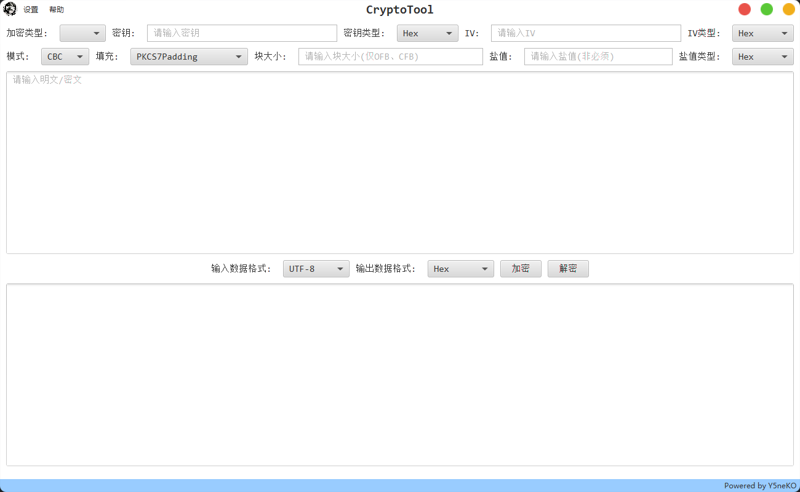
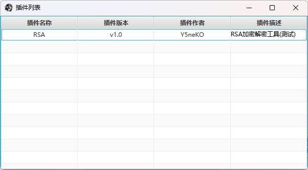

# CryptoTool
Integrated encryption and decryption tool.

综合加密解密工具。

## Environment
`JDK 8u411` | `Maven 3.8.6` | `IntelliJ IDEA 2024.1`

## Release Note
- `2024/08/13`: v0.1 Released.
- `2024/08/15`: v0.2 Released.
- `2024/08/16`: v0.3 Released.

## Completed Features
- 国密
  - SM3 加密
  - SM4 加密/解密
- 常见加密
  - MD5 加密
  - NTLM Hash 加密
  - AES 加密/解密
  - DES 加密/解密
- 常见资产密文加解密
  - Finalshell 加密/解密
  - Navicat11/12+ 加密/解密
  - Seeyon数据库 加密/解密
- 其他功能
  - 从文件导入/导出结果
  - 插件功能

## Planned Features
- SM2 加密/解密
- RSA 加密/解密
- 常见资产数据库密文解密(e.g. 用友NC、金蝶)

## Screenshot


## Plugins
v0.3版本开始支持插件功能。

### 使用方法
1. 下载插件
2. 将插件放置到同目录的`plugins`目录下
3. 重启软件



### 插件开发
1. 引入api包

项目地址: https://github.com/Y5neKO/CryptoToolAPI

2. 开发规范

- 插件主类包名为: `com.y5neko.plugin`;
- 主类名和文件名必须一致: 例如`RSA.jar`则主类名为`RSA`;
- 主类实现`com.y5neko.utils.Plugins`接口;
- 主类继承`javafx.stage.Stage`;
- 主类定义四个全局静态字段(`pluginName`, `pluginVersion`, `pluginDescription`, `pluginAuthor`)用以获取插件信息;

```java
public static String pluginName = "RSA";    // 插件名称
public static String pluginVersion = "v1.0"; // 插件版本
public static String pluginDescription = "RSA加密解密工具(测试)";    // 插件描述
public static String pluginAuthor = "Y5neKO";    // 插件作者
```

example:

```java
package com.y5neko.plugin;

import com.y5neko.utils.Plugins;

import javafx.scene.Scene;
import javafx.stage.Stage;

public class RSA extends Stage implements Plugins {
    public static String pluginName = "RSA";
    public static String pluginVersion = "v1.0";
    public static String pluginDescription = "RSA加密解密工具(测试)";
    public static String pluginAuthor = "Y5neKO";
    @Override
    public void showStage() {
        // 主窗口逻辑
    }

    @Override
    public String getPluginName() {
        return "RSA";
    }

    @Override
    public String getPluginVersion() {
        return "v1.0";
    }

    @Override
    public String getPluginDescription() {
        return "RSA加密解密工具(测试)";
    }

    @Override
    public String getAuthor() {
        return "Y5neKO";
    }
}
```

## Thanks
[how-does-navicat-encrypt-password](https://github.com/HyperSine/how-does-navicat-encrypt-password)

[FatSmallTools](https://github.com/tianhe1986/FatSmallTools)

## LICENSE
[MIT](LICENSE)